# Catch me if you can !

캐치마인드를 모두 함께 즐기자 ! 
  

## 프로젝트 개요

### 팀 노션
https://www.notion.so/SA-7-dedad350490f461e8fea17b78552fad1

 

### 1.👋프로젝트 소개

캐치마인드를 여러 사람들과 함께 문제도 내고 정답을 맞춰보는 자유로운 공간 입니다. 
여러분들의 상상력을 발휘해 문제도 출제하고 정답도 맞춰 보세요!
  

### 2.⏳ 프로젝트 기간

 <strong>2022년 8월 12일 ~ 2022년 8월 18일 </strong>

 

### 3. 👨‍👩‍👧‍👦프로젝트 멤버

FrondEnd(React)  
배아랑이 - 메인화면, 상세화면 
나소나 - 글 작성화면, 글 수정화면, 디자인 
김민석 - 로그인, 회원가입 
 
Backend(Spring) 
김보슬(팀장) - 글, 댓글 CRUD 
문경록 - 로그인, 회원가입 CRUD 
 

### 4. ⚙기술 스택
#### 개발 환경

Backend

Frontend

#### 배포 환경

Backend

Frontend

#### 협업 도구

#### 개발 도구

Backend

Frontend

 

### 5. 🎨와이어프레임
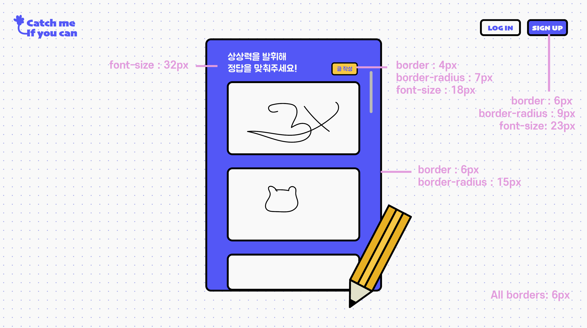
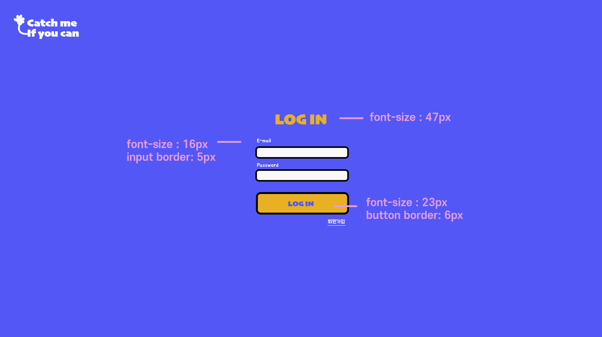
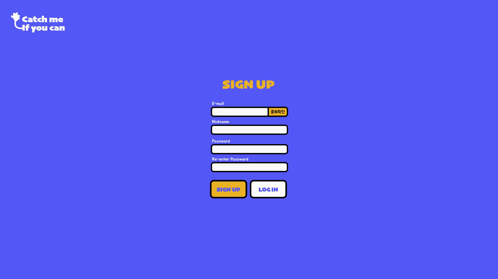
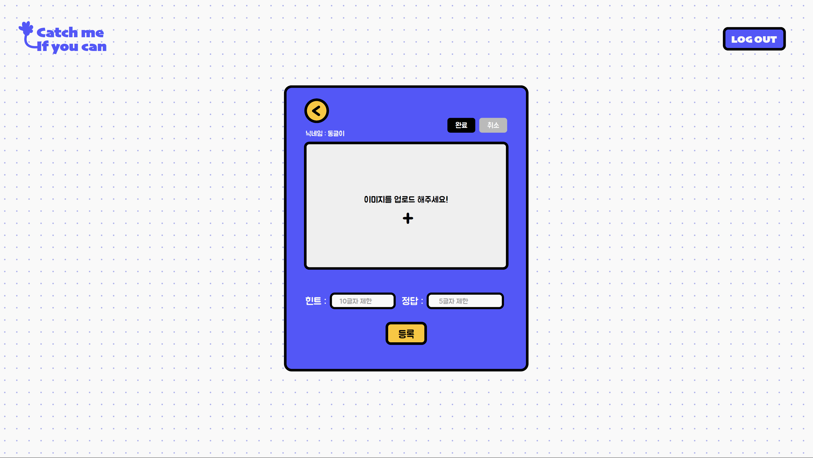
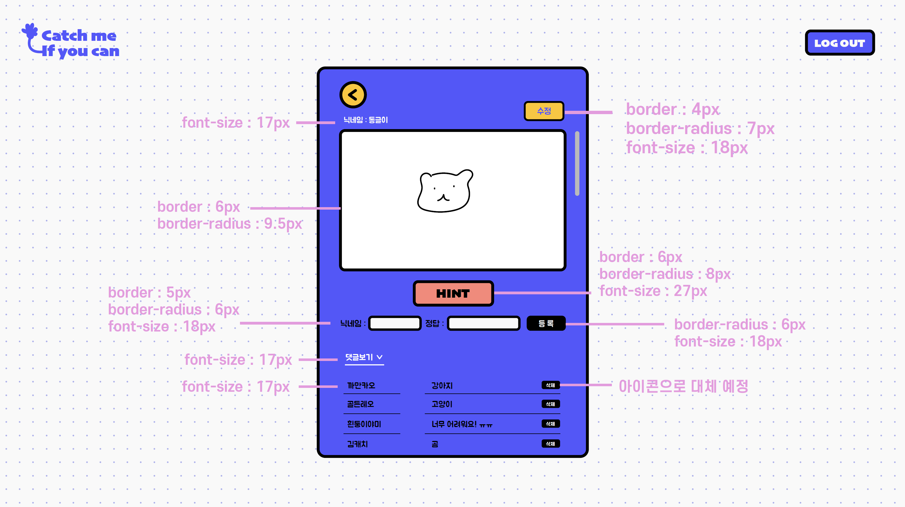

 

### 6. 📃API 명세서
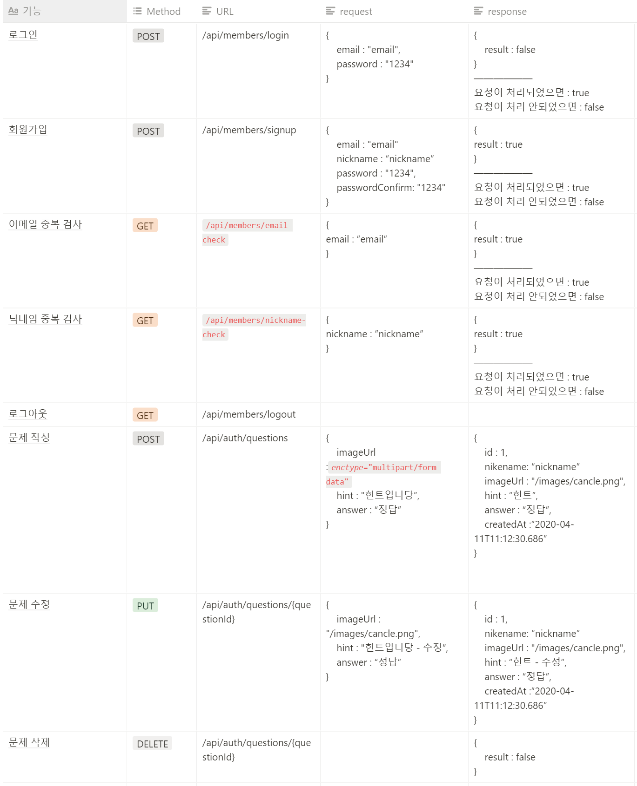

 

## 7. 🛠구현 기능 및 소개

1.  회원가입/로그인

- Spring Security , JWT인증방식을 사용하여 로그인, 로그아웃 기능 구현

2.  문제출제

- 문제 목록 조회,등록,수정,삭제
- 상세조회
- 이미지등록,수정,삭제

3.  댓글

- 댓글 조회,등록,삭제

 

## 8. 🖥구현 화면

1. 회원가입 화면 
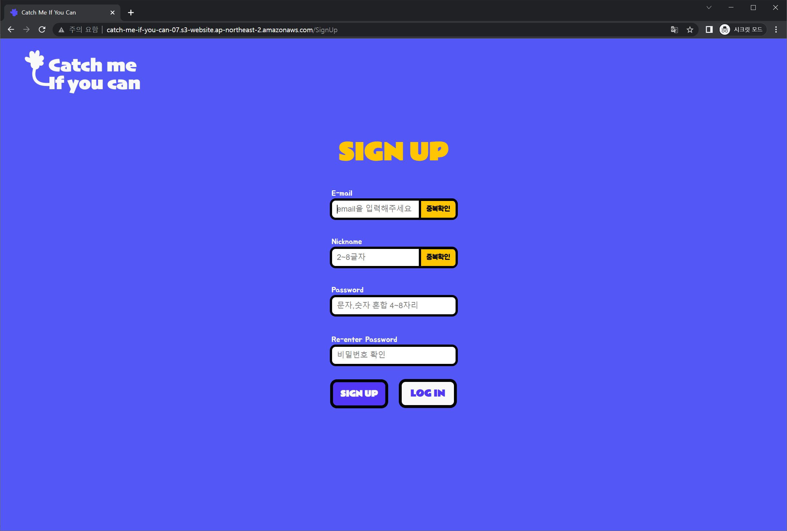
 

2. 로그인 화면 
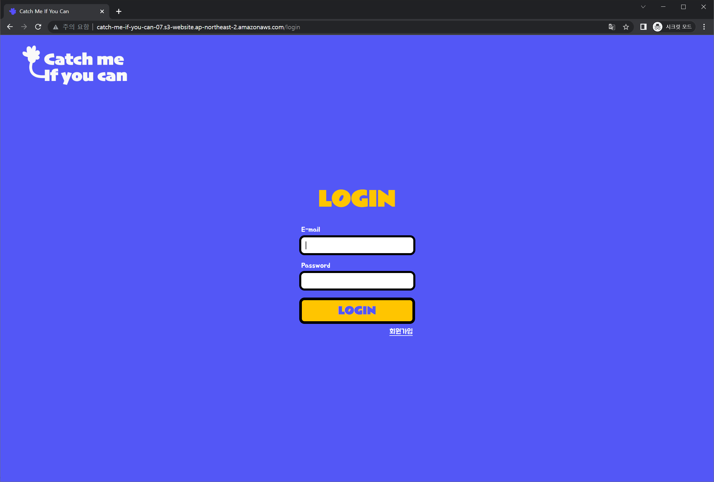
 

3. 메인 화면 
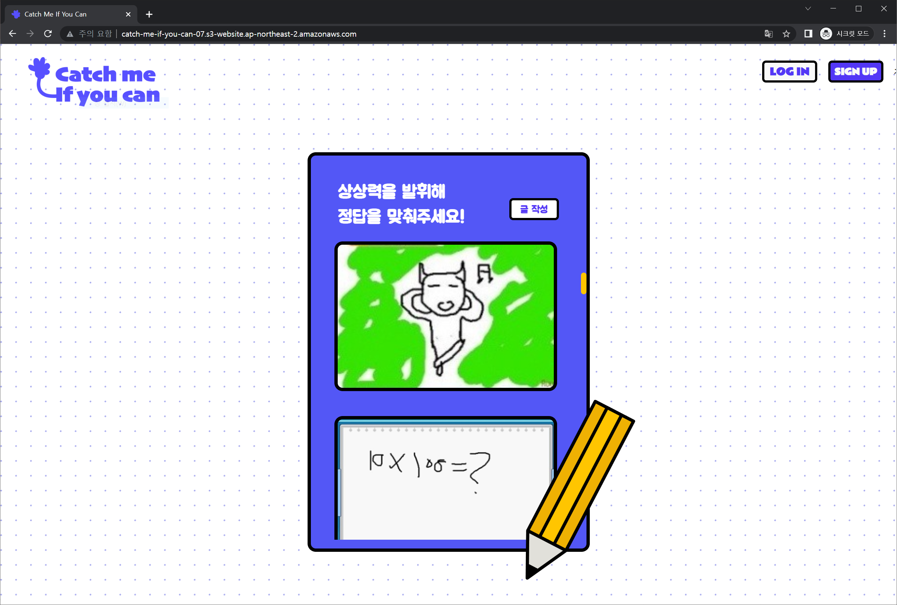
 

   
4. 글 상세보기 화면 
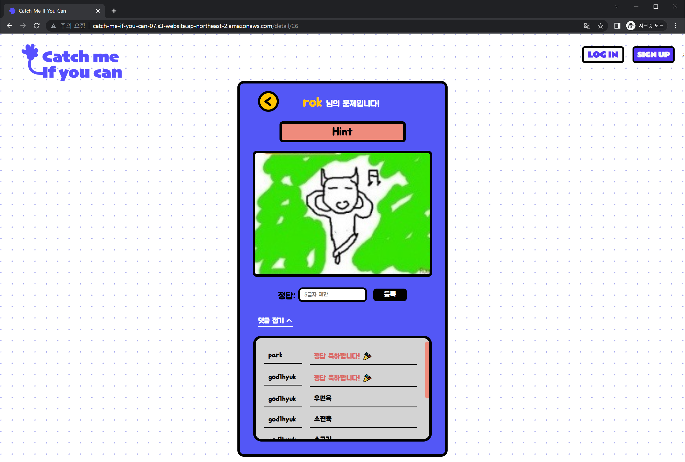
 
   
5. 글 작성 화면 
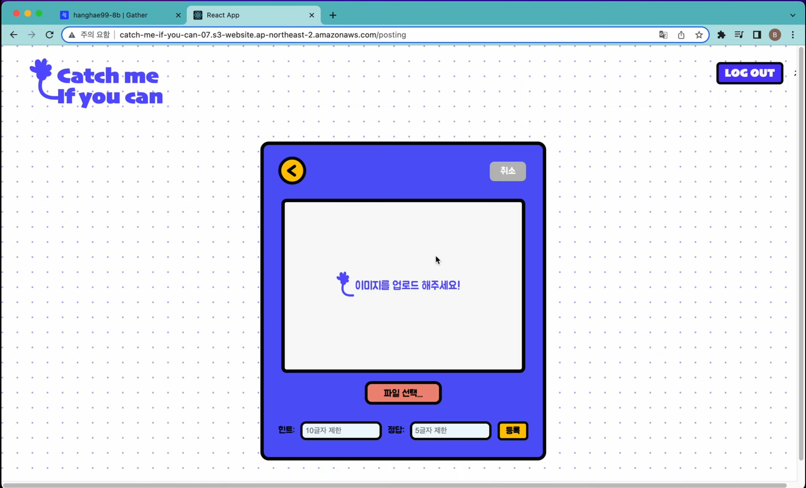
 

6. 글 수정 화면 
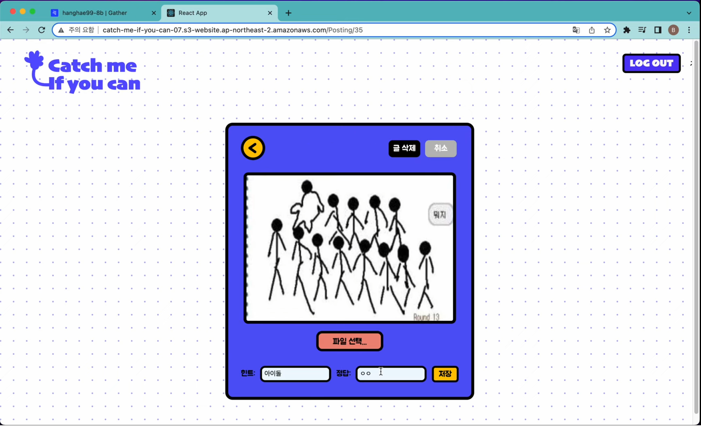
 
